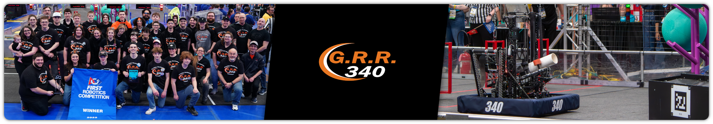

## FRC Team 340 - Greater Rochester Robotics

Team 340, G.R.R. (Greater Rochester Robotics) is a high school robotics team that competes annually in the FIRST Robotics Competition. Every year, our students are challenged to design, build, and program a competitive industrial-sized robot capable of playing a field game that is released in January.

With the goal of fostering collaboration, Team 340 releases our robot code publicly in this GitHub organization. Here you can also find other programming-related resources, such as robot logs and our template repository.

Our robot code for the 2026 REBUILT season can be found [here](https://github.com/Greater-Rochester-Robotics/Rebuilt2026-340).

